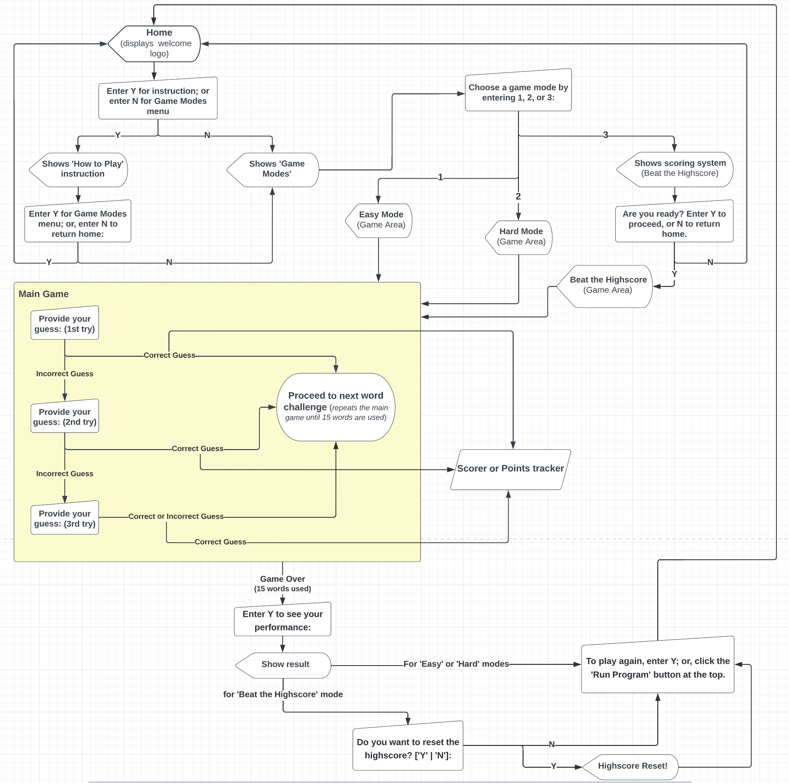

# Guess That Word
<!-- use ezgif -->
**‘Guess that Word’** is a terminal game that tests the English vocabulary of its users by letting them guess words as they are defined. It gives them 3 game modes to choose from: (1) Easy, (2) Hard, and (3) Beat the Highscore. The ‘Easy’ mode and ‘Hard’ mode each provide 15 words to guess and the number of correct guesses will be shown to the user at the end. For the ‘Beat the Highscore’ mode, the user will also be provided with 15 words (8 are easy, and 7 are hard) but with a scoring; and at the end of the game the total score will be shown and a highscore will be saved locally which the user can beat in the future. In all these modes of the game, 3 hints are provided: (1) the number of letters, (2) 1st and last letters - after first failed try, and (3) more letters within the word - after 2nd failed try. For each word, the user is only allowed to guess three (3) times.

## TABLE OF CONTENTS
* [User Experience Design (UXD)](#user-experience-design-uxd)
    * [Strategy](#strategy)
        * [Main Goal](#main-goal)
        * [Target Audience](#target-audience)
        * [User Stories](#user-stories)
    * [Scope](#scope)
        * [Planned Features](#planned-features)
        * [Design Choice](#design-choice)
    * [Structure](#structure)
    * [Skeleton](#skeleton)
    * [Surface](#surface)
* [Features](#features)
    * [Home](#home)
    * [How To Play](#how-to-play)
    * [Game Modes](#game-modes)
    * [Game Area](#game-area)
    * [Hints](#hints)
    * [Display of Correct Answer](#display-of-correct-answer)
    * [Input Prompts](#input-prompts)
    * [Input Validations and Feedbacks](#input-validations-and-feedbacks)
    * [Input Case-Insensitivity](#input-case-insensitivity)
    * [Scoring System](#scoring-system)
    * [Saving of Highscore](#saving-of-highscore)
    * [Performance Display](#performance-display)
    * [Re-running the Program](#re-running-the-program)
* [Fixed Bugs](#fixed-bugs)
<!-- add more contents here -->

___
## USER EXPERIENCE DESIGN (UXD)

### STRATEGY
#### Main Goal:
* The main goal of this game is to test the English vocabulary of its users, and/or help them learn English words while enjoying the excitement and stress-relieving nature of an online game. [View live website here.](https://guess-that-word-game.herokuapp.com/)

#### Target Audience:
* People who want to test and challenge their English vocabulary.
* People who enjoy learning the English language.
* People who want to improve their English vocabulary and, at the same time, want to do it in a fun way.

#### User Stories:
* As a user, I want to test my English vocabulary by playing a game that provides a definition and I will have to guess the word it defines.
* As a user, I want to learn new words to add to my vocabulary by playing a game.
* As a user, I want to have some help in guessing a word if I find it difficult by providing hints.
* As a user, I want to be able to choose an easy game mode that will provide easy words to guess.
* As a user, I want to be able to choose a hard game mode that will provide hard words to guess.
* As a user, I want the game to track my progress in building my vocabulary by scoring my correct guesses.
* As a user, I want to challenge myself in the game by having the chance to beat my previous performance.
* As a user, I want the highscore to be saved and be reset if desired.
* As a user,  I want to learn as I play by providing the correct answer immediately.

### SCOPE
#### **Planned Features:**
Using the user stories, I have planned the following features:
* User Story:
    > As a user, I want to test my English vocabulary by playing a game that provides a definition and I will have to guess the word it defines.
    * IMPLEMENTATION:
        * The game will show a word definition to the user and the they will be asked to guess the word it defines by typing it in the terminal.
* User Story:
    > As a user, I want to learn new words to add to my vocabulary by playing a game.  
    * IMPLEMENTATION:
        * The game will show the correct answer after every word challenge.
* User Story:
    > As a user, I want to have some help in guessing a word if I find it difficult by providing hints.
    * IMPLEMENTATION:
        * Three (3) hints will be provided in every word challenge. The initial hint will be the number of characters by showing an underscore for each letter in the word. If the user is unable to guess on the 1st try, the 2nd hint will be by revealing the first and last letters. If the user still cannot guess it, the 3rd and last hint will be the additional letters within the word that will be revealed.
* User Story:
    > As a user, I want to be able to choose an easy game mode that will provide easy words to guess.
    * IMPLEMENTATION:
        * The game will include an easy mode which will provide common and mostly short words that the user will guess.
* User Story:
    > As a user, I want to be able to choose a hard game mode that will provide hard words to guess.
    * IMPLEMENTATION:
        * The game will include a hard mode which will provide either long words or words that are relatively 'not so' common.
* User Story:
    > As a user, I want the game to track my progress in building my vocabulary by scoring my correct guesses.
    * IMPLEMENTATION:
        * The game will include a 'Beat the Highscore' mode, which will have a scoring system. In each word challenge, if the user correctly guesses the word on 1st try, they will earn 5 points; if on the 2nd try, they will have 3 points, and on the 3rd try, 1 point will be awarded.
* User Story:
    > As a user, I want to challenge myself in the game by having the chance to beat my previous performance.
    * IMPLEMENTATION:
        * In the 'Beat the Highscore' mode, the total score of the user will be displayed at the end of the game and will be compared to the highscore saved in their computer. If the user's score is the first score or highest score played in their computer, it will be saved locally to set as, or to replace, the highscore.
* User Story:
    > As a user, I want the highscore to be saved, and be reset if desired.
    * IMPLEMENTATION:
        * The highscore will be saved locally in the user's computer, and the user will be given the option to reset it at the end of the game in the 'Beat the Highscore' mode.
* User Story:
    > As a user,  I want to learn as I play by providing the correct answer immediately.
    * IMPLEMENTATION:
        * After each word challenge, the correct word will be displayed along with its definition before proceeding to the next word to guess.

#### **Design Choice:**
As this is a game played on a terminal, therefore the design option is limited, I still endeavoured to  make it as visually appealing, intuitive and simplistic as it can be. This is achieved by using ascii arts, making the terminal look uncluttered by clearing it after every group of displayed data/information, and providing only necessary data in the terminal at each moment.

### STRUCTURE
#### **Interaction Design**
* Clear & Intuitive Feedback
    * All invalid inputs to the prompts are handled with appropriate and clear feedback messages that usually hint the user on how to correct it. In any case that the feedback message does not inform the user of what to do to have a valid input, the original prompt is displayed for the user to read again.
    * In the word challenge, if the user enters a wrong answer (including a single letter, but not longer than the correct word) their input will be displayed, and they will be asked to try again; if they enter a word or group of letters longer than the correct word, the feedback will specify this issue; and if they enter a character that is not in the English alphabet, the feedback message will also specify this.
* Consistent
    * Consistency is seen various features of the program.
    * How the feedback messages are displayed is consistent. Its colour is always red and rests on top of the original prompt. And all displayed data/information are centre-aligned.
* Predictable
    * Predictability is evident on this program. When an input is entered, the user can predict that a feedback message will show if the input is invalid; and if it is valid, the program  will continue.
    * On the game area, the definition, placeholder, prompts and feedbacks are always expected to be displayed on the same spots due to the single-screen and no-scrolling feature of the program. This helps user to locate these datas easily and avoids confusion and enhances the user-friendly interface of the program.
    * The program always does what its prompt tells the user that it will do if a valid input is entered.
* Learnability
    * The user is provided a specific, easy-to-understand, and succint prompts as the user runs the program. This enhances the learnability of the program and the game itself.
    * The game is also designed to be simple and intuitive, and, thus, learnable.
    * Due to its clean, uncluttered and simplified layout, the user can easily see all the data/information in the terminal screen.
* Functional Minimalism
    * The program prevents overwhelming of the user by many displayed data on the screen through keeping the program clean, simple, uncluttered, and minimalist. Only appropriate and needed groups of information are provided at each time. This is made possible by the clear_terminal function that this program utilizes, which keeps the terminal screen from being a long scrollable screen.
    * As this is a terminal game, the user can only provide input when it is prompted.

### SKELETON
#### **Data Model**

* **Program Flowchart**     
Below is the flowchart of the main process of this Python program. It starts with the Home section, which displays the main LOGO, and ends to the prompt for the user to play again. It shows the entire cycle of the program.

* **Functions, Classes, & Imports Relational Diagram**  
The following diagram shows the flow of the functions inside the main() function, which holds the entire process of the program - from start to finish and back. It also reveals the relationship of the functions, classes and imported modules with each other.   
The **solid arrow lines** imply the sequential flow of the functions, while the **broken arrow lines** symbolize the direct relationship of the classes, modules, and libraries (internal & external) to each other.

### SURFACE
* **Ascii arts**    
The following ascii arts are taken from: [fsymbols](https://fsymbols.com/generators/carty/)
<!-- screenshots of ascii arts here -->

* **Colorama**  
The Colorama module is used to provide color to the terminal texts. Aside from its aesthetic purpose, it also enhances the meaning and importance of the displayed message or information.
<!-- screenshot here -->

* **No-scrolling screen feature.**
This program prevents the tendency of scrolling by displaying only a group of data that can fit the screen at each moment. It does not allow for texts to be repeated printed on the screen, which could make it look untidy, and overwhelming to the user.
<!-- gif -->

* To see features of the final product, go to [FEATURES](#features).

## FEATURES
### **Home**    
* The 'Home' section is the first display of texts/data in the terminal when the pogram runs. It contains the ascii art logo/title 'Guess that Word' with a line of text underneath it. Also, it shows a prompt for the user to enter an input either 'Y' to see the instruction on how to play, or 'N' to proceed to the Game Menu.
<!-- screenshot -->

### **How to Play** 
* As the user enters the designated input (enter 'Y') to view the instruction while in the 'Home' section, the 'How to Play' content will be revealed below the ascii art logo inside the 'Home' section.
<!-- screenshot -->

### **Game Modes**
* The different game modes will be shown under the ascii art logo/title, and the user will be prompted to choose among the options by entering either number '1', '2', or '3'.
* There are 3 game modes that the user can play: [1] Easy mode, [2] Hard mode, and [3] Beat the Highscore. Each of these modes will provide 15 words for the user to guess. The **Easy mode** will give easy or common words, and are usually short', while the **Hard mode** will give relatively hard or uncommon words, and can sometimes be long. For the **Beat the Higschore** mode, this will be a combination of easy & hard words (first 8 words are easy, and the rest are hard) with the added feature of scoring system and highscore challenge.
[See 'How to Play' section.](#how-to-play)
<!-- screenshot -->

### **Game Area**
* The game area is where the game happens. It has a header which contains the game title (to the left) and the number of words left to guess. The 'Easy' and 'Hard' modes have an added display of correct guesses, while the 'Beat the Higshcore' mode has the score tracker display.
* It also displays the definition of the word to guess and the word placeholders, which are underscores equivalent to the number of letters the word has.
* Inside the game area, the user will be prompted to provide their guess to the definition. The answer (input) has to be the full word and correctly spelled. The input is not case-sensitive, so both upper and lower cases are accepted.
<!-- screenshot -->

### **Hints**
To make the game more fun and less arduous, hints to the answer are provided. For every word challenge, there are 3 hints provided:   
* 1st hint - the "number of characters" the word has through the placeholders (underscores) that are displayed on the game area.    
* 2nd hint - 1st and last letters of the word. These are provided after the 1st failed try.
* 3rd hint - more supplied letters within the word: 2 letters for words with less than 8 characters; and 3 letters for words with 8 or more characters.
<!-- screenshot -->

### **Display of Correct Answer**
The correct answer is revealed immediately after 3 failed guesses.
<!-- screenshot -->

### **Input prompts**
As this is a Python terminal game, the user is required to use their keyboard to type in an input to the program. Prompts are provided, which are yellow-coloured texts, and will specify the required input to proceed in the game.
<!-- screenshot -->

### **Input Validations and Feedbacks**
All inputs that the user will enter in the program as prompted will be validated to check if it follows the specified and required data input. If the user's input fails the validation, the game will return a feedback message which will be a red-coloured text to inform that user that they have entered an invalid input. These feedback messages will show at the top of the input prompt.
<!-- screenshot -->

### **Input Case-Insensitivity**
Upper case or lower case or a combination of both are allowed as input.
<!-- screenshot -->

### **Scoring System**
The 'Beat the Highscore' game mode has a scoring system in place. For each word challenge, when the user correctly guesses the word on the first try, they earn 5 points; on the 2nd try (with 2nd hint), 3 points is awarded; and on the 3rd try (with 3rd hint), 1 point is added to their total score. A score tracker is displayed at the header of the game area.
<!-- screenshot -->

### **Saving of Highscore**
* On the 'Beat the Highscore' mode, the highscore in the game played in the user's computer will be saved locally. This highscore will be compared with the current player's score at the end of the game, and will be shown as a text feedback.
* If current user's score is higher than the last recorded highscore, it will be replaced with the user's current score as the new highscore. A text feedback confirming this will also be shown on the terminal.
* If there are no recorded highscore, the current user's score will be recorded as the highscore.
<!-- screenshot -->

### **Performance Display**
When the user finishes the 15-word challenge, a prompt will ask the user to see their performance result by entering a specified key. When the required input is entered, the following will be displayed:
* For 'Easy' and 'Hard' game modes, their total number of correct guesses will be revealed.
* For the 'Beat the Highscore' game mode, the program will show total number of their correct guesses, and their total score.
<!-- screenshot -->

### **Re-running the Program**
As the user finishes the game, they are asked if they want to play again. And if they wish to re-run the game to play, they will need to enter the letter 'Y' to proceed.
<!-- screenshot -->

## FIXED BUGS
* **ISSUE:**  
When I ran the program after refactoring the script into different modules, an error showed up which states `ImportError: cannot import name 'Game' from partially initialized module 'game_manager' (most likely due to a circular import)`.  

    * **INTENDED OUTCOME:**    
    I expect the script to still run as smoothly as it had without any error before I refactored the code.    

    * **SOLUTION:**     
    After some research in the web, [bobbyhadz blog](https://bobbyhadz.com/blog/python-importerror-cannot-import-name) gave me the idea to solve the problem.
    I realized that the problem occured because I imported score_manager module in the game_manager module, and vice versa. This resulted to the ImportError due to a circular import. So to solve, I removed the accidentally imported game_manager module from score_manager module, and the program ran perfectly.   

* **ISSUE:**       
I noticed that when I played the 'Beat the Highscore' game mode, the score tracker being displayed at the top of the terminal screen would revert the score to the previous result when a wrong input is entered to proceed to the next word challenge. 

    * **INTENDED OUTCOME:**     
    I expect the score tracker to display the score consistently without fail. The added points should be reflected in the score as soon as the player correctly guessed the word, and it should not change until another point is added into it.   

    * **SOLUTION:**     
    As this was a logical error, I traced back the code, especially the validator for wrong inputs on that certain section. After some deep thoughts and analysis, I found the cause, updated the passed in argument to the involved function, and it finally worked perfectly as intended.

## BUGS LEFT TO FIX
<!-- content here -->

## TESTING
<!-- content here -->
<!-- Pep8 online -->

## DEPLOYMENT
	
### **Version Control**
**Git** was a crucial tool used to track changes that were made in the repository. The following git commands were mainly used in developing this program:

* `git status` — to show the status of the repository by displaying the files that have been staged and are ready for commit, those that are not, and those that are untracked.
* `git add <file name>` — to add file or changes in the file to the staging area before they can be commited
* `git commit -m "message"` — to add/record file or changes to the local repository
* `git push` — to upload the local repository to the remote repository, such as GitHub

### **Heroku Deployment**
This website is published on [Heroku](https://www.heroku.com). The following were the steps I took for this project's deployment.
1. I logged in to my Heroku account.
2. Then, I was redirected into this url `https://dashboard.heroku.com/apps`. Inside, I clicked the 'New' button which was a dropdown menu. Between the two (2) options it showed, I clicked on 'Create new app'.
3. Then, on the 'Create New App' page, I typed in my 'app name' and 'region' on their respected input fields. Then I clicked the 'create app' button that is sitting at the bottom of the aforementioned fields. This then redirected me to my new app's page in Heroku.
4. On my new app's page, there is a row of links, which includes: Overview, Resources, Deploy, Metrics, Activity, Access, and Settings. 
5. I first went to 'Settings' by clicking its link. Inside the 'Settings', I clicked on 'Reveal Config Vars' and added 'PORT' in the key field, and '8000' in the value field, then clicked on the 'add' button beside them.
6. Then, on the 'Buildpacks' section, I clicked the 'Add buildpack' button and added python (1st) and nodejs (2nd) - the ordering is important.
7. Then, I went to the 'Deploy' link and clicked on Github as the Deployment Method.
8. Below the Deployment Method section is the Connect to Github section. Here I searched for the name of my new app in Github using the search input field provided. When the name of the repository was displayed, I clicked on 'connet' button.
9. After few minutes, it revealed a button to view the deployed website.

### **Cloning from Github**
To clone the repository for this site, do the following steps:  
1. Go to this url: https://github.com/marked-gil/guess-that-word
2. Inside the repository, look for the button labeled as '**Code**', which is along the rows with other buttons such as 'Go to file' and 'Add file'.
3. Click on the '**Code**' button, and a small popup box will show up with a top heading of '**Clone**'.
4. In the popup box, click on the 'HTTPS' link and copy the url just below it.
5. Then, go to your computer's terminal and type `git clone https://github.com/marked-gil/guess-that-word`
6. A copy of the repository is now saved in your computer.

## TECHNOLOGIES USED
The following are the technologies used in this project:
* Programming Language:
    * Python
* Python Modules/Libraries:
    * [os](https://docs.python.org/3/library/os.html) - a built-in module to use operating-system-dependent functionality
    * [sys](https://docs.python.org/3/library/sys.html) - a built-in module where the sys.executable and sys.argv came from, which were passed into the os.execv method to restart the game.
    * [random](https://docs.python.org/3/library/random.html) - a built-in module that generates pseudo-randomness.
    * [localStoragePy](https://pypi.org/project/localStoragePy/) - an external Python package that allows local storage of data
    * [colorama](https://pypi.org/project/colorama/) - an external Python package that colors the terminal text
* Gitpod — the cloud-based IDE (Integrated Developer Environment) used to build this site.
* Git — as a version control system, was used to monitor and record changes made when building the site. This allowed for the restoration of an earlier version of the code when it was necessary.
* GitHub — stores the source code repository for this website.
* LucidCharts
* Diffchecker - used when comparing codes tested in another IDE to the codes in gitpod.
* [Fsymbols](https://fsymbols.com/generators/carty/) - generates ascii text art
* For test and validating:
    * [pep8](http://pep8online.com/)

## CREDITS
### **Content**
* Words & Definitions   
The  words and definitions used in this game is taken from [Merriam-Webster](https://www.merriam-webster.com/).

* Ascii Arts 
    * [fsymbols](https://fsymbols.com/generators/carty/) - where the all the ascii arts used as logos in this game are taken from.

### **References**
* Main Python references:
    * [W3Schools](https://www.w3schools.com/)
    * [Geeks for Geeks](https://www.geeksforgeeks.org/)
    * [Python.org](https://docs.python.org/3/)
    * [Code Institute Lessons](https://codeinstitute.net/ie/)
    * [100 Days of Code: The Python Pro Bootcamp by Dr. Angela Yu](https://www.udemy.com/course/100-days-of-code/)      

* Static vs Class Methods   
    * [Tech with Tim Youtube video](https://www.youtube.com/watch?v=MpuOuZKWUWw) - for static vs class methods  

* [Stackoverflow](https://stackoverflow.com/), especially for the following links:
    * [A simple method to clear the terminal using](https://stackoverflow.com/questions/2084508/clear-terminal-in-python) `print(“\033c")`
    * [Restarting Python script using](https://stackoverflow.com/questions/11329917/restart-python-script-from-within-itself) `os.execv(sys.executable, ['python'] + sys.argv)` 

* [Bobby Handz Blog](https://bobbyhadz.com/blog/python-importerror-cannot-import-name) - Shows reason and solution to my issue on `ImportError: cannot import name 'Game' from partially initialized module 'game_manager' (most likely due to a circular import)`.

## ACKNOWLEDGMENT
* Ms. Daisy McGirr, my Code Institute mentor, of her guidance and suggestions in this project.
* My wife, Kyle, for the full support even as I burn the midnight oil.